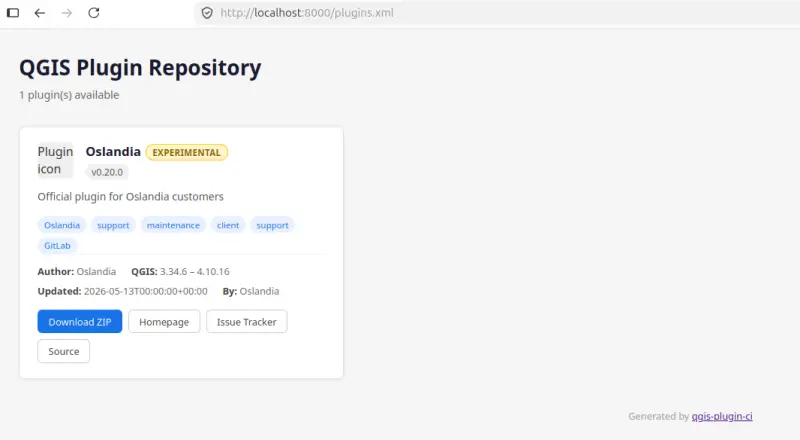

<!-- markdownlint-disable MD041 -->

## Custom repository

```sh
qgis-plugin-ci package -c -u https://oslandia.gitlab.io/qgis/oslandia/ latest
```

Generates the following `plugins.xml` file:

```xml
<?xml version = '1.0' encoding = 'UTF-8'?>
<?xml-stylesheet type="text/xsl" href="plugins.xsl"?>
<plugins>
    <pyqgis_plugin name="Oslandia" version="0.20.0">
        <about><![CDATA[The Oslandia plugin that gives access to our news, ideas, fun features and exclusive support services for our end-customers right into QGIS.]]></about>
        <author_name><![CDATA[Oslandia]]></author_name>
        <create_date>2026-05-15T00:00:00+00:00</create_date>
        <deprecated>False</deprecated>
        <description><![CDATA[Official plugin for Oslandia customers]]></description>
        <download_url>https://oslandia.gitlab.io/qgis/oslandia/oslandia.0.20.0.zip</download_url>
        <experimental>True</experimental>
        <file_name>oslandia.0.20.0.zip</file_name>
        <homepage><![CDATA[https://oslandia.gitlab.io/qgis/oslandia/]]></homepage>
        <icon>resources/images/default_icon.png</icon>
        <repository><![CDATA[https://gitlab.com/Oslandia/qgis/oslandia/]]></repository>
        <qgis_maximum_version>4.10.16</qgis_maximum_version>
        <qgis_minimum_version>3.34.6</qgis_minimum_version>
        <server>False</server>
        <tags><![CDATA[Oslandia,support,maintenance,client,support,GitLab]]></tags>
        <tracker><![CDATA[https://gitlab.com/Oslandia/qgis/oslandia/-/issues]]></tracker>
        <update_date>2026-05-15T00:00:00+00:00</update_date>
        <uploaded_by><![CDATA[Oslandia]]></uploaded_by>
        <version>0.20.0</version>
    </pyqgis_plugin>
</plugins>
```

Since its version 2.10, it comes by default with a [plugins.xsl stylesheet](https://github.com/opengisch/qgis-plugin-ci/blob/master/qgispluginci/repository/plugins.xsl) to make the `plugins.xml` human-readable. If you prefer having a raw `plugins.xml`, use the `--no-repository-stylesheet` option.


